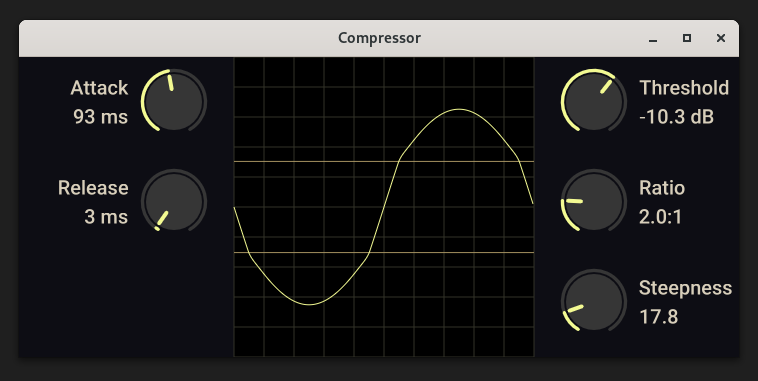
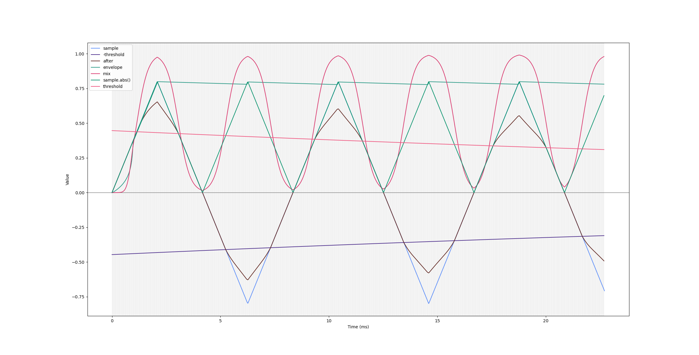

# Compressor
Custom compressor to learn VST3 plugin development. Build VST3 plugin with `make build`. All other make targets are debug builds.

# Plugalyzer
Requires [Plugalyzer](https://github.com/CrushedPixel/Plugalyzer) for certain make targets used for low level debugging, e.g. `make triangle`, which plots some small amount of samples and other debug values using matplotlib:



Needs package `ladspa`:
```
pacman -S ladspa
```

Build with:
```
git clone https://github.com/CrushedPixel/Plugalyzer
cd Plugalyzer
git submodule init
git submodule update --recursive
# Had to add #include <utility> to juce_StandardHeader.h for this to work
cmake .
make
```
Then add the binary `Plugalyzer_artefacts/plugalyzer` to $PATH as `plugalyzer`.

For Plugalyzer to recognize the plugin make sure that it is installed to `~/.vst3`:
```
ln -s /path/to/clone/dir/target/bundled/Compressor.vst3/
```