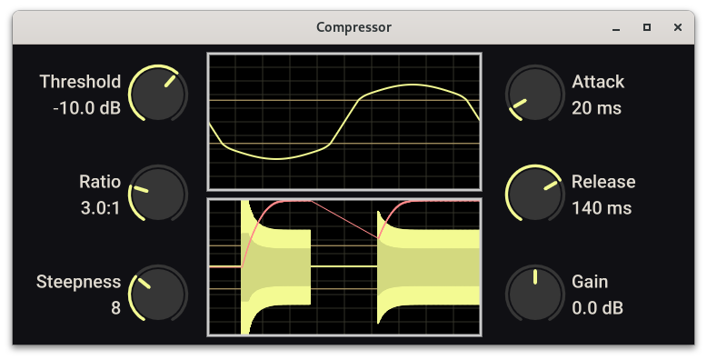

# Compressor
Custom compressor to learn VST3 plugin development. Build VST3 plugin with `make build`. All other make targets are debug builds. The compressor has six parameters:

* Threshold: Level above which to start compressing.

* Ratio: Amount of compression

* Steepness: measure of quickly the compression engages. A low steepness means that as the actual audio level approaches the threshold the compressor will gradually already engage. A high steepness will bemore like the compressor engaging not at all under the threshold and immediately after it goes overthe threshold. It is a measure of how smooth the knee is.

* Attack: Time in ms until the compressor fully engages.

* Release: Time in ms until the compressor is fully disengaged.

* Gain: gain to apply after compression.

# Plugalyzer
Requires [Plugalyzer](https://github.com/CrushedPixel/Plugalyzer) for certain make targets used for low level debugging, e.g. `make triangle`, which plots some small amount of samples and other debug values using matplotlib:


Needs package `ladspa`:
```
pacman -S ladspa
```

Build with:
```
git clone https://github.com/CrushedPixel/Plugalyzer
cd Plugalyzer
git submodule init
git submodule update --recursive
# Had to add #include <utility> to juce_StandardHeader.h for this to work
cmake .
make
```
Then add the binary `Plugalyzer_artefacts/plugalyzer` to $PATH as `plugalyzer`.

For Plugalyzer to recognize the plugin make sure that it is installed to `~/.vst3`:
```
ln -s /path/to/clone/dir/target/bundled/Compressor.vst3/
```